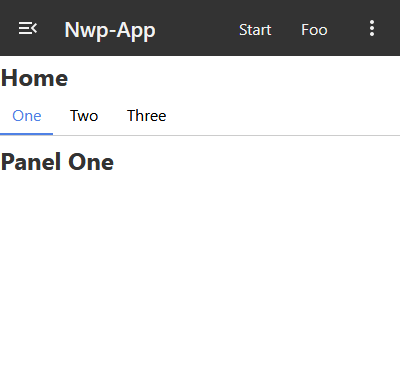
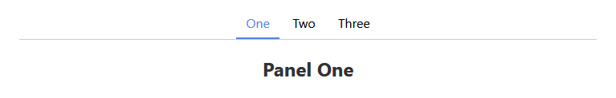
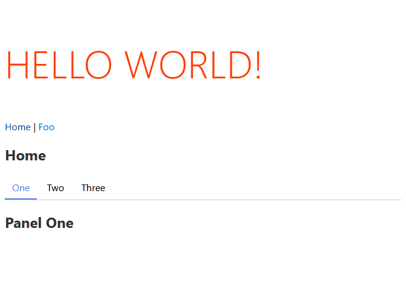
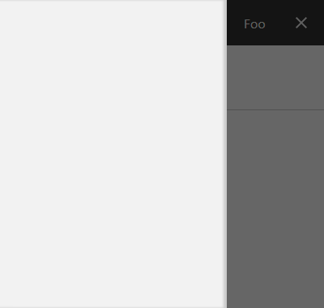

 
 
 <a href="https://github.com/sonjavanteese/nwp-svelte-components" target="_blank">Github Link</a>
 
 
#### Collection Bundle of favorits Components
 
 
 
 
 
## Svelte-Tabs 


 <a href="https://github.com/joeattardi/svelte-tabs" target="_blank">Origin</a>
 
 
> `'./nwp/svelte-tabs/index.js'`





```javascript
import { Tabs, Tab, TabList, TabPanel } from './nwp/svelte-tabs/';

//  ./nwp/svelte-tabs/index.js

export { default as Tab } from './Tab.svelte';
export { default as Tabs } from './Tabs.svelte';
export { default as TabList } from './TabList.svelte';
export { default as TabPanel } from './TabPanel.svelte';
```

**Usage**

```javascript
<script>
	import { Tabs, Tab, TabList, TabPanel } from './nwp/svelte-tabs/';
	export let name;
</script>

<section name="Tabs">
	<Tabs>
		<TabList>
		  <Tab>One</Tab>
		  <Tab>Two</Tab>
		  <Tab>Three</Tab>
		</TabList>
	  
		<TabPanel>
		  <h2>Panel One</h2>
		</TabPanel>
	  
		<TabPanel>
		  <h2>Panel Two</h2>
		</TabPanel>
	  
		<TabPanel>
		  <h2>Panel Three</h2>
		</TabPanel>
	  </Tabs>
</section>
```

## svelte-navaid

<a href="https://github.com/jacwright/svelte-navaid" target="_blank">Origin</a>



*Getting Started*

```bash
npm i --save svelte-navaid
```

#### Custum Route Component

**Exampel**

```svelte
<script>
  import Router from "./nwp/navaid/Router.svelte";
  import Route from "./nwp/navaid/Route.svelte";
  import Link from "./nwp/navaid/Link.svelte";
</script>

<Router>
  <h1>Hello World!</h1>

  <Link href="/">Home</Link> | <Link href="foo/sub1">Foo</Link>

  <Route path="/">
    <h2>Home</h2>
  </Route>

  <!-- Supports navaid wildcards -->
  <Route path="/foo/*">
    <h2>Foo</h2>

    <!-- Supports subroutes with relative URLs (prefixed with /foo/ here) -->
    <Router>

      <!-- Links are relative to the subroute they appear in -->
      <Link href="sub1">Sub 1</Link> | <Link href="/sub2">Sub 2</Link>

      <Route path="/sub1">
        <h3>Sub Foo 1</h3>
      </Route>

      <Route path="/sub2">
        <h3>Sub Foo 2</h3>
      </Route>

    </Router>
  </Route>


  <!-- Supports 404 pages -->
  <Route>
    <h2>Page Not Found</h2>
  </Route>
</Router>
```

## Top App-Bar w. Sidebar Navigation





| Component  | Usage    |
|------------|----------|
| AppWrapper | Wrapper for Full Height  |
| AppBar | Top Bar with Sidebar Toggle |
| AppDrawer | Sidebar Panel |


```javascript
import { AppWrapper, AppBar, AppDrawer } from "./nwp/appbar/";
// Props
let isOpen = false; // toggle Sidebar
let isMenu = false; // optional Use
// Actions
function toggleSb() {
isOpen = !isOpen;
}
function toggleMenu() {
  isMenu = !isMenu;
}
// Sidebar Enable
const sb = true;
```

**Exampel**

```html
<AppWrapper>
  <AppDrawer bind:isOpen /> 
  <!-- AppDrawer Slot Items need .sblink Class -->
  <AppBar {sb} bind:isOpen bind:isMenu>
  <!-- AppBar Slot Items need .appbar-item Class -->
    <link href="/" class="appbar-item" Start/>
    <link href="foo/sub1" class="appbar-item" Foo/>
  </AppBar>
	<main id="main">
	
	<!-- Main Content -->
	
	</main>
</AppWrapper>
```


